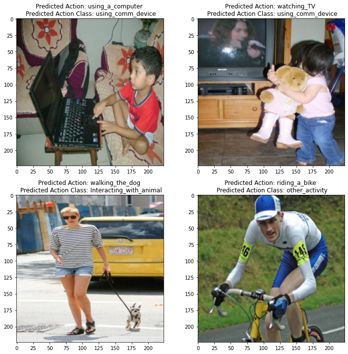
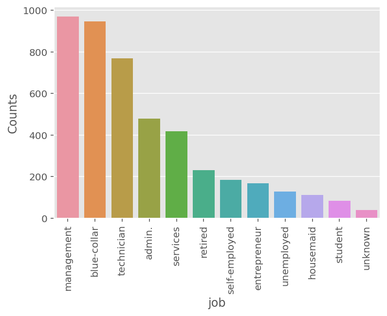
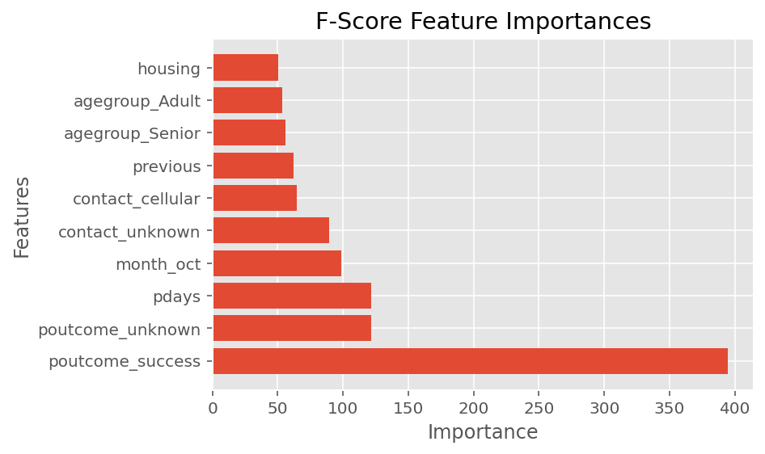

# Roy Portfolio

# [Project 1 : Action and Action Class Prediction](https://github.com/roywong96/cnn_action_prediction)

- Aim of the project is to develop Convolutional Neural Network for a multi-output predictions.
- Obtained 3030 training and 2100 testing images containing 21 different actions under 5 action classes.
- Since the number of training samples is small of approximate 1940 images, data augmentation is used which is a technique to randomly transform the images to artificially expand the training size.
- Model developed comprised of two parts: one is used as the feature extractor with Transfer Learning that is made up of ‘MobileNetV2’ blocks, and the other is the classifier part which is made up of the fully connected layers and the output layer with Softmax as the chosen activation function for the final layer. 
- Model achieved 81% in predicting action and 92% in predicting action class on an Identical and Independent Dataset (IID).

# [Project 2 : IMBD Ratings Predictor](https://github.com/roywong96/imbd_proj)

- Created a tool that predicts movie ratings from the imbd website
- Scraped over 2000 movies from imbd website using Python and Beautiful Soup
- Engineered features from the genres to quatify the value for each genre such as drama, action, thriller, comedy, romance and so forth.
- Optimized Linear, Lasso, Bayesian Ridge and Random Forest Regressor using GridSearchCV to reach the best model.
- A deep dive into data leakage to prevent target from leaking into models I chose for an accurate prediction.
- Evaluated the models using Mean Absolute Error for better understanding and simplicty. 
- Obtained low R2 for all the models as movie ratings are based on human sentiments and in these scenarios, people are just harder to predict.   

    
    

# [Project 3 : Time-Series Analysis Retail Sales for Recreational Goods](https://github.com/roywong96/RetailSales)

Analysis conducted through a Model-Building Strategy to find the best fitting model for the data of monthly retail sales in millions of dollars for recreational goods in New Zealand from 1995 to 2010. Forecast for monthly retail sales for recreational goods in New Zealand for the next 10 units of time will be given at the end of the report. 

- Checking for trend, seasonality and stationarity in the data through the ACF and PACF.
- BOX-COX transformation and Differencing performed to achieve stationarity/de-trend the series. 
- Using the EACF a the BIC table to select a few candidate models.
- Residual Analysis to determine whether the model selected is suitable for forcasting. Final model selected through this analysis is SARIMA(1,1,2)X(1,1,1)12 proceed with the forecasting.
- Through model diagnostics, it can be proven that SARIMA(1,1,2)X(1,1,1)12 is a reliable and promising model to predict as follows.
- The following plot shows the prediction of the next 10 units.
- Complete web report can be found on [Rpubs](https://rpubs.com/roywong96/633767).

# [Project 4 : Term Deposit: Subscribe or Not Subscribe](https://github.com/roywong96/termDepositSubscription)

- Data obtained from UCI Machine Learning Repository Bank Dataset
- Cleaned and Preprocessed the Dataset.
- Performed Exploratory Data Analysis on the dataset to gain insights and trends in the data.
- Perform One-Hot Encoding for the categorical variables to be used for modeling.
- Optimized K Nearest Neighbors, Bayesian Naive Bayes, Decision Tree and Random Forest Classifier using GridSearchCV to reach the best model.
- A deep dive into data leakage to prevent target from leaking into models I chose for an accurate prediction.
- Performance measure used to evaluate the models is the Area Under the Receiver Operating Characteristic (ROC) Curve due to class imbalance in the dataset.

    
    

