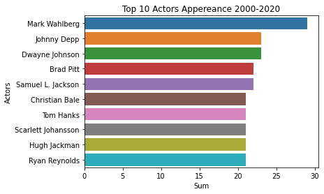
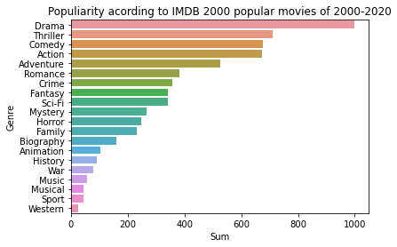
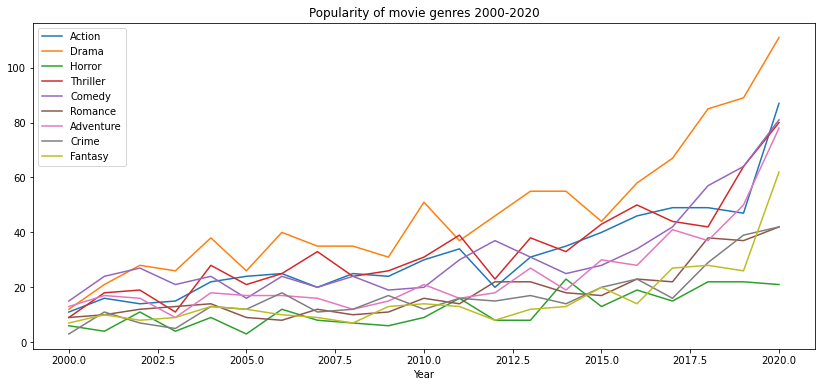
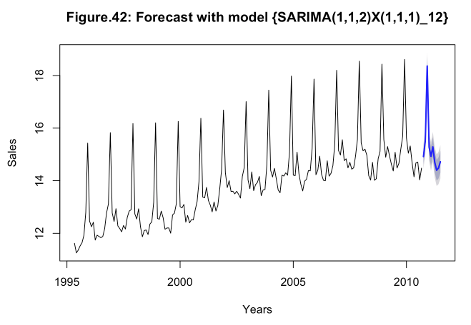
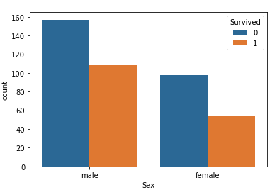
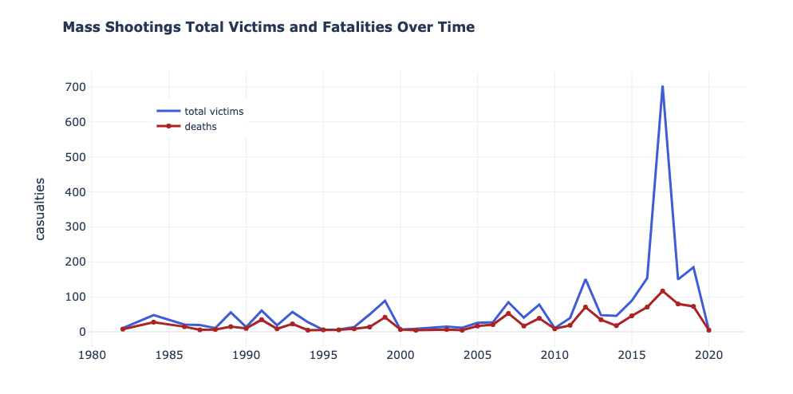

# [Project 1 : IMBD Ratings Predictor](https://github.com/roywong96/imbd_proj)

- Created a tool that predicts movie ratings from the imbd website
- Scraped over 2000 movies from imbd website using Python and Beautiful Soup
- Engineered features from the genres to quatify the value for each genre such as drama, action, thriller, comedy, romance and so forth.
- Optimized Linear, Lasso, Bayesian Ridge and Random Forest Regressor using GridSearchCV to reach the best model.
- A deep dive into data leakage to prevent target from leaking into models I chose for an accurate prediction.
- Evaluated the models using Mean Absolute Error. 
- Obtained the score R2 for all the models as movie ratings are based on human sentiments and in these scenarios, people are just harder to predict.   

# [Project 2 : Time-Series Analysis Retail Sales for Recreational Goods](https://github.com/roywong96/RetailSales)

Analysis conducted through a Model-Building Strategy to find the best fitting model for the data of monthly retail sales in millions of dollars for recreational goods in New Zealand from 1995 to 2010. Forecast for monthly retail sales for recreational goods in New Zealand for the next 10 units of time will be given at the end of the report. 

- Checking for trend, seasonality and stationarity in the data through the ACF and PACF.
- BOX-COX transformation and Differencing performed to achieve stationarity/de-trend the series. 
- Using the EACF a the BIC table to select a few candidate models.
- Residual Analysis to determine whether the model selected is suitable for forcasting. Final model selected through this analysis is SARIMA(1,1,2)X(1,1,1)12 proceed with the forecasting.
- Through model diagnostics, it can be proven that SARIMA(1,1,2)X(1,1,1)12 is a reliable and promising model to predict as follows.
- The following plot shows the prediction of the next 10 units.
- Complete report in R can be found on [Rpubs](https://rpubs.com/roywong96/633767).

# [Project 3 : Titanic: Machine Learning from Disaster](https://github.com/roywong96/Titanic/blob/main/Titanic.ipynb)

- Two sets of data (i.e. Train and Test set) concatenated and preprocessed before modeling 
- Removed outliers, imputed any missing values and normalized the fare to obtain more accurate predictions.
- Engineered Features such as Family Size, Title (i.e 'Fam_Size', 'Title').
- Optimized and classified using Logistic Regression, K Neighbors Classifier, Support Vector Classifier, Gaussian Naive Bayes, Decision Tree Classifier, Random Forest Regressor.
- Voting Classifier is also used which takes all of the inputs and averages the results.
- Plot results using Bar graph of the Survivability of the passengers on the test data based on the trained.
- Accurately predicted 77.9% of the test set.

# [Project 4 : Mass Shootings in the United States](https://github.com/roywong96/Shooting_Analysis/blob/main/ShootingAnalysis.ipynb)

- Obtaining insight from the Data by MotherJones 
- This research is focused on indiscriminate rampages in public places resulting in four or more victims killed by the attacker.
- Seek to identify the cause of such Mass Killing in the USA.
- Several question included in the analysis
    - Are mass shootings on the rise?
    - What state/city had the most victims from mass shootings?
    - which states have the highest number of mass shootings?
    - Which year has the most mass shootings?
    - Which year did deadliest shootings in US occured and where?
    - Are most mass killers males or females?
    - Were the weapons used in shootings obtained legally?
    - What are the age of the youngest / oldest shooter?
    - What are the majority race of the shooters?
    - How many school shootings have been since 1982?
- A more visual slide show presentation done in [Slidy R](https://rpubs.com/roywong96/684364).

